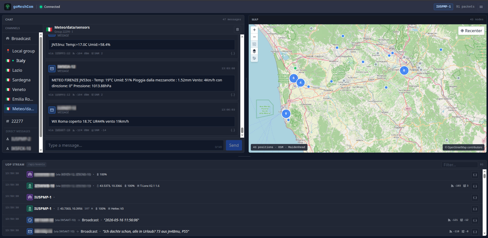

# goMeshCom

Web client for the [MeshCom](https://icssw.org/en/meshcom/) mesh radio network.
Listens for UDP packets from a local MeshCom node and provides a browser UI for real-time monitoring, chat, and node tracking.



## Quick Start

**Prerequisites:** a MeshCom node reachable from the goMeshCom host (default UDP port 1799).

If this is your first network setup, follow the step-by-step guide first:

- [First Setup](docs/first-setup.md)

### Binary

```bash
./gomeshcomd --my-call="XX0YY-1"
```

Open `http://localhost:8080`.

The node address is **auto-detected** from the first incoming UDP packet — no further configuration needed for typical setups.

For a fresh node, make sure ExtUDP on the device points to the host running `gomeshcomd`, and allow inbound UDP `1799` on that host before starting the service.

If you want to open the web UI from other machines, start `gomeshcomd` on `0.0.0.0:8080` or on the specific IP you want to expose, then allow inbound TCP `8080` in the firewall. Keep the default loopback bind if access should stay local.

### Docker

```bash
docker run -d \
  -p 8080:8080 \
  -p 1799:1799/udp \
  -v gomeshcom-data:/data \
  -e GOMESHCOM_MY_CALL=XX0YY-1 \
  -e GOMESHCOM_HTTP_ADDR=0.0.0.0:8080 \
  ghcr.io/logocomune/gomeshcom:latest
```

Open `http://<host-ip>:8080`.

If the node does not broadcast automatically, or you want to pin the address, set it explicitly — this disables auto-detection:

```bash
-e GOMESHCOM_NODE_ADDR=192.168.1.100:1799
```

To mirror every received UDP packet to other consumers, set one or more forwarding targets:

```bash
-e GOMESHCOM_FORWARD_TARGETS=192.168.1.60:1799,192.168.1.61:1799
```

Use this when one MeshCom node should feed multiple tools or additional `gomeshcomd` instances. The forwarder copies incoming UDP datagrams byte-for-byte before parsing them, so downstream services receive the same payloads that this instance received.

### Optional Web UI Authentication

For shared LAN deployments, protect the UI and API with a username and password:

```bash
docker run -d \
  -p 8080:8080 \
  -p 1799:1799/udp \
  -v gomeshcom-data:/data \
  -e GOMESHCOM_MY_CALL=XX0YY-1 \
  -e GOMESHCOM_HTTP_ADDR=0.0.0.0:8080 \
  -e GOMESHCOM_AUTH_USERNAME=meshcom \
  -e GOMESHCOM_AUTH_PASSWORD=change-me \
  ghcr.io/logocomune/gomeshcom:latest
```

When authentication is enabled:

- unauthenticated API and SSE requests return `401 Unauthorized`
- the browser UI opens a sign-in modal
- successful login creates an HTTP-only session cookie

Keep the browser on the same origin as the Go server (for example `http://192.168.1.50:8080`) so REST and SSE can reuse the same session cookie.

## Features

- Real-time packet stream via Server-Sent Events
- Chat per conversation (broadcast, channels, direct messages)
- Node map with OpenLayers — color-coded by freshness, clustering for dense areas
- Outgoing messages with duplicate suppression
- UDP RX forwarding to one or more downstream listeners
- MeshCom IoT UDP simulator for local position-packet testing
- Multi-arch Docker image (`linux/amd64`, `linux/arm64`)

## Configuration

All options via environment variable or CLI flag (prefix `GOMESHCOM_`).

| Variable | Default | Description |
|---|---|---|
| `GOMESHCOM_MY_CALL` | `XX0XX-1` | **Required.** Your station callsign (e.g. `IU5PMP-1`) |
| `GOMESHCOM_NODE_ADDR` | *(empty)* | Node UDP address. When empty, learned from the first incoming UDP packet. When set, used as-is — auto-detect is disabled. |
| `GOMESHCOM_HTTP_ADDR` | `127.0.0.1:8080` | HTTP listen address |
| `GOMESHCOM_UDP_LISTEN_ADDR` | `0.0.0.0:1799` | UDP listen address |
| `GOMESHCOM_FORWARD_TARGETS` | *(empty)* | Comma-separated `host:port` list that receives a byte-for-byte copy of every incoming UDP datagram |
| `GOMESHCOM_DATA_DIR` | `./data` | Persistent data directory |
| `GOMESHCOM_SEND_DELAY` | `40s` | Minimum delay between outgoing messages |
| `GOMESHCOM_MAX_MESSAGE_LENGTH` | `149` | Maximum outgoing message length (UTF-8 chars) |
| `GOMESHCOM_LOG_LEVEL` | `info` | `debug` \| `info` \| `warn` \| `error` |
| `GOMESHCOM_RECEIVE_LOG_ENABLED` | `true` | Write received UDP packets to JSONL |
| `GOMESHCOM_RECEIVE_LOG_RETENTION_DAYS` | `365` | Daily log files to keep |
| `GOMESHCOM_RECEIVE_LOG_REPLAY_WINDOW` | `1h` | Packets replayed on SSE reconnect |
| `GOMESHCOM_CHAT_LOG_HISTORY_WINDOW` | `24h` | Default chat history window |
| `GOMESHCOM_CHAT_LOG_MAX_HISTORY_WINDOW` | `720h` | Maximum chat history via API |
| `GOMESHCOM_SEND_DEDUP_TTL` | `2s` | Duplicate suppression window (`0` disables) |
| `GOMESHCOM_AUTH_USERNAME` | *(empty)* | Optional HTTP auth username. Must be set together with `GOMESHCOM_AUTH_PASSWORD`. |
| `GOMESHCOM_AUTH_PASSWORD` | *(empty)* | Optional HTTP auth password. Must be set together with `GOMESHCOM_AUTH_USERNAME`. |
| `GOMESHCOM_AUTH_SESSION_TTL` | `24h` | Session lifetime after successful login |
| `GOMESHCOM_AUTH_COOKIE_NAME` | `meshcom_session` | Session cookie name |

## Build from Source

```bash
# Requires Go 1.26+ and Node.js 22+
./build.sh
# Output: bin/
```

## Local UDP Simulation

Use the IoT simulator to feed changing position packets into a local `gomeshcomd` instance:

```bash
go run ./cmd/iot-simulator -my-call IQ5SIM-9
```

The simulator can send MeshCom `pos` packets from `QQ1TST-1` and `QQ1TST-2`, plus scheduled DM, broadcast, and channel-2 messages to `127.0.0.1:1799`, based on enabled flags. Use any combination of `-enable-pos1`, `-enable-pos2`, `-enable-dm`, `-enable-broadcast`, and `-enable-chan2` to enable timed sends; without them the simulator stays in receive-only responder mode. It also responds to DMs for `QQ1TST-1` and `QQ1TST-2` with readable TX/RX logs. See [MeshCom IoT UDP Simulator](docs/iot-simulator.md) for flags.

## Disclaimer

> **Provided "as is", without warranty of any kind.**
>
> Use of this software for radio communications is subject to the regulations of your national telecommunications authority. The user is solely responsible for compliance with applicable laws and licensing requirements.
>
> Not affiliated with the MeshCom project or its developers.

## License

See [LICENSE](LICENSE) for details.
