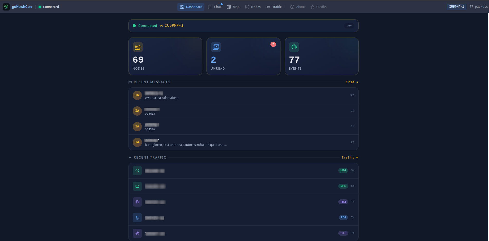
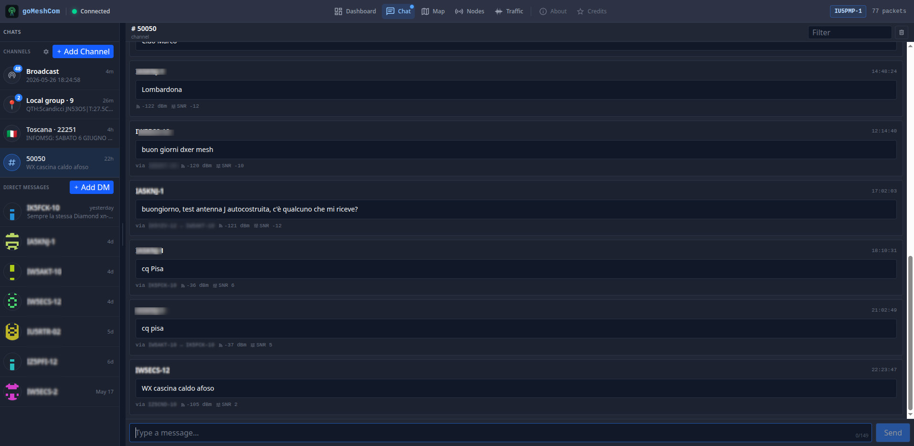
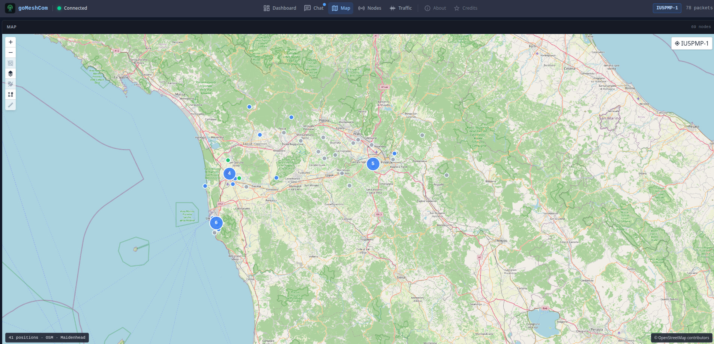

# gomeshcom-client

Unofficial Go-based web client for receiving UDP or serial traffic from a local [MeshCom](https://icssw.org/en/meshcom/) node.

It receives packets from a MeshCom node and provides a browser UI for real-time monitoring, chat, and node tracking.

The main executable is `gomeshcomd`.

> **Note:** `gomeshcom-client` is an independent, unofficial project.  
> It is not affiliated with, endorsed by, or maintained by the MeshCom project or its developers.

| Dashboard | Chat | Map |
|:---------:|:----:|:---:|
|  |  |  |

## Quick Start

**Prerequisites:** a MeshCom node reachable over UDP (default port `1799`) or an explicit serial device using firmware 4.35+.

If this is your first network setup, follow the step-by-step guide first:

- [First Setup](docs/first-setup.md)

## Documentation

Browse current setup, feature, operational, and MeshCom reference material in [docs/README.md](docs/README.md).

### Binary

```bash
./gomeshcomd --my-call="QQ0YY-1"
```

Open:

```text
http://localhost:8080
```

The node address is **auto-detected** from the first incoming UDP packet — no further configuration is needed for typical setups.

For a fresh node, make sure ExtUDP on the device points to the host running `gomeshcomd`, and allow inbound UDP `1799` on that host before starting the service.

If you want to open the web UI from other machines, start `gomeshcomd` on `0.0.0.0:8080` or on the specific IP you want to expose, then allow inbound TCP `8080` in the firewall. Keep the default loopback bind if access should stay local.

### Docker

```bash
docker run -d \
  -p 8080:8080 \
  -p 1799:1799/udp \
  -v gomeshcom-data:/data \
  -e GOMESHCOM_MY_CALL=QQ0YY-1 \
  -e GOMESHCOM_HTTP_ADDR=0.0.0.0:8080 \
  ghcr.io/logocomune/gomeshcom:latest
```

Open:

```text
http://<host-ip>:8080
```

If the node does not broadcast automatically, or you want to pin the address, set it explicitly — this disables auto-detection:

```bash
-e GOMESHCOM_NODE_ADDR=192.168.1.100:1799
```

To mirror every received UDP packet to other consumers, set one or more forwarding targets:

```bash
-e GOMESHCOM_FORWARD_TARGETS=192.168.1.60:1799,192.168.1.61:1799
```

Use this when one MeshCom node should feed multiple tools or additional `gomeshcomd` instances. The forwarder copies incoming UDP datagrams byte-for-byte before parsing them, so downstream services receive the same payloads that this instance received.

### Serial

UDP remains the default. To connect through USB serial instead:

```bash
GOMESHCOM_TRANSPORT_MODE=serial \
GOMESHCOM_SERIAL_DEVICE=/dev/ttyUSB0 \
./gomeshcomd --my-call="QQ0YY-1"
```

Default serial framing is `115200 8N1`, no flow control. Select modem lines for
your hardware:

```sh
# ESP32 / CP2102, typically /dev/ttyUSB0: avoid reset or bootloader entry
GOMESHCOM_SERIAL_DTR=false \
GOMESHCOM_SERIAL_RTS=false

# nRF52 / RAK USB CDC, typically /dev/ttyACM0: expose active USB serial connection
GOMESHCOM_SERIAL_DTR=true \
GOMESHCOM_SERIAL_RTS=false
```

See [Serial Transport](docs/serial.md) for TOML, platform, reconnect, terminal,
and Docker instructions.

When running in Docker, pass the host serial device into the container. For example:

```yaml
services:
  gomeshcomd:
    devices:
      - /dev/ttyUSB0:/dev/ttyUSB0
```

Set `GOMESHCOM_SERIAL_DEVICE=/dev/ttyUSB0` inside the container to match the
container-side device path.

### Optional Web UI Authentication

For shared LAN deployments, protect the UI and API with a username and password:

```bash
docker run -d \
  -p 8080:8080 \
  -p 1799:1799/udp \
  -v gomeshcom-data:/data \
  -e GOMESHCOM_MY_CALL=QQ0YY-1 \
  -e GOMESHCOM_HTTP_ADDR=0.0.0.0:8080 \
  -e GOMESHCOM_AUTH_USERNAME=meshcom \
  -e GOMESHCOM_AUTH_PASSWORD=change-me \
  ghcr.io/logocomune/gomeshcom:latest
```

When authentication is enabled:

- unauthenticated API and SSE requests return `401 Unauthorized`
- the browser UI opens a sign-in modal
- successful login creates an HTTP-only session cookie
- active sessions survive server restarts until their configured TTL expires

Keep the browser on the same origin as the Go server, for example:

```text
http://192.168.1.50:8080
```

This allows REST and SSE requests to reuse the same session cookie.

## Features

- Responsive UI — works on desktop, tablet, and smartphone browsers
- Real-time packet stream via Server-Sent Events
- Chat per conversation: broadcast, channels, and direct messages
- Node map with OpenLayers: color-coded by freshness, with clustering for dense areas
- Outgoing messages with duplicate suppression
- UDP datagram or extracted serial JSON forwarding to downstream listeners
- Local UDP simulator for MeshCom-compatible test packets
- Single compact binary, with no external runtime required
- Runs on Linux, Windows, macOS, and Raspberry Pi-class devices
- Multi-arch Docker image (`linux/amd64`, `linux/arm64`)

## Configuration

All options are available via environment variable or CLI flag using the `GOMESHCOM_` prefix.

| Variable | Default | Description |
|---|---|---|
| `GOMESHCOM_TRANSPORT_MODE` | `udp` | Node transport: `udp` or `serial`. Missing values preserve UDP behavior. |
| `GOMESHCOM_MY_CALL` | `QQ0XX-1` | Startup station callsign default, for example `IU5PMP-1` or `QQ1ABC-1`. Input is trimmed and uppercased. The active callsign can also be changed at runtime from the web UI and is persisted under `data/configs/station.json`. |
| `GOMESHCOM_NODE_ADDR` | *(empty)* | Node UDP address. When empty, it is learned from the first incoming UDP packet. When set, it is used as-is and auto-detect is disabled. |
| `GOMESHCOM_HTTP_ADDR` | `127.0.0.1:8080` | HTTP listen address |
| `GOMESHCOM_UDP_LISTEN_ADDR` | `0.0.0.0:1799` | UDP listen address |
| `GOMESHCOM_SERIAL_DEVICE` | *(empty)* | Explicit serial path or COM port; required in serial mode |
| `GOMESHCOM_SERIAL_BAUD` | `115200` | Serial baud rate |
| `GOMESHCOM_SERIAL_DATA_BITS` | `8` | Serial data bits |
| `GOMESHCOM_SERIAL_PARITY` | `none` | `none` \| `odd` \| `even` \| `mark` \| `space` |
| `GOMESHCOM_SERIAL_STOP_BITS` | `1` | `1` \| `2` |
| `GOMESHCOM_SERIAL_FLOW_CONTROL` | `none` | Serial flow control; currently `none` |
| `GOMESHCOM_SERIAL_DTR` | `false` | DTR state; enable for nRF52/RAK USB CDC |
| `GOMESHCOM_SERIAL_RTS` | `false` | RTS state |
| `GOMESHCOM_FORWARD_TARGETS` | *(empty)* | Comma-separated `host:port` list receiving each UDP datagram or extracted serial JSON payload |
| `GOMESHCOM_DATA_DIR` | `./data` | Persistent data directory |
| `GOMESHCOM_SEND_DELAY` | `40s` | Minimum delay between outgoing messages |
| `GOMESHCOM_MAX_MESSAGE_LENGTH` | `149` | Maximum outgoing message length, in UTF-8 characters |
| `GOMESHCOM_LOG_LEVEL` | `info` | `debug` \| `info` \| `warn` \| `error` |
| `GOMESHCOM_RECEIVE_LOG_ENABLED` | `true` | Write received packets to JSONL |
| `GOMESHCOM_RECEIVE_LOG_RETENTION_DAYS` | `365` | Number of daily log files to keep |
| `GOMESHCOM_RECEIVE_LOG_REPLAY_WINDOW` | `1h` | Packets replayed on SSE reconnect |
| `GOMESHCOM_CHAT_LOG_HISTORY_WINDOW` | `24h` | Default chat history window |
| `GOMESHCOM_CHAT_LOG_MAX_HISTORY_WINDOW` | `720h` | Maximum chat history via API |
| `GOMESHCOM_STORAGE_PURGE_INTERVAL` | `4h` | Interval between SQLite purge runs |
| `GOMESHCOM_STORAGE_RECEIVE_LOG_RETENTION` | `720h` | SQLite receive-log row retention (`30d` in TOML) |
| `GOMESHCOM_STORAGE_PUBLIC_CHAT_RETENTION` | `720h` | SQLite public-chat row retention (`30d` in TOML) |
| `GOMESHCOM_STORAGE_NODES_RETENTION` | `168h` | SQLite node retention based on `lastseen` (`7d` in TOML) |
| `GOMESHCOM_STORAGE_TELEMETRY_RETENTION` | `720h` | SQLite telemetry row retention (`30d` in TOML) |
| `GOMESHCOM_SEND_DEDUP_TTL` | `2s` | Duplicate suppression window; `0` disables it |
| `GOMESHCOM_AUTH_USERNAME` | *(empty)* | Optional HTTP auth username. Must be set together with `GOMESHCOM_AUTH_PASSWORD`. |
| `GOMESHCOM_AUTH_PASSWORD` | *(empty)* | Optional HTTP auth password. Must be set together with `GOMESHCOM_AUTH_USERNAME`. |
| `GOMESHCOM_AUTH_SESSION_TTL` | `24h` | Session lifetime after successful login |
| `GOMESHCOM_AUTH_COOKIE_NAME` | `meshcom_session` | Session cookie name |

## Build from Source

```bash
# Requires Go 1.26+ and Node.js 22+
./build.sh
# Output: bin/
```

## Local UDP Simulation

Use the UDP simulator to feed changing position packets into a local `gomeshcomd` instance:

```bash
go run ./cmd/iot-simulator -my-call QQ5SIM-9
```

The simulator can send MeshCom-compatible `pos` packets from `QQ1TST-1` and `QQ1TST-2`, plus scheduled DM, broadcast, and channel-2 messages to `127.0.0.1:1799`, based on enabled flags.

Use any combination of these flags to enable timed sends:

```text
-enable-pos1
-enable-pos2
-enable-dm
-enable-broadcast
-enable-chan2
```

Without them, the simulator stays in receive-only responder mode.

It also responds to DMs for `QQ1TST-1` and `QQ1TST-2` with readable TX/RX logs.

See [UDP Simulator](docs/iot-simulator.md) for flags and examples.

## Disclaimer

> **Provided "as is", without warranty of any kind.**
>
> Use of this software for radio communications is subject to the regulations of your national telecommunications authority. The user is solely responsible for compliance with applicable laws and licensing requirements.
>
> `gomeshcom-client` is an independent, unofficial project.
>
> Not affiliated with, endorsed by, or maintained by the MeshCom project or its developers.

## License

See [LICENSE](LICENSE) for details.
