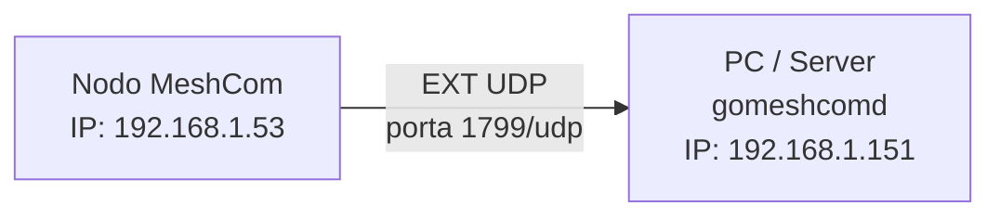

# Configurare MeshCom EXT UDP con `gomeshcomd`

Questa guida descrive come collegare un nodo **MeshCom** a `gomeshcomd` usando l'interfaccia **EXT UDP** del firmware MeshCom.

L'obiettivo è fare in modo che il nodo invii i pacchetti UDP al computer o server dove è in esecuzione `gomeshcomd`, così da poter ricevere dati, messaggi ed eventi tramite l'interfaccia del programma.

> **Nota:** questa guida riguarda `gomeshcomd`. MeshCom, MeshCom Firmware e altri software compatibili con MeshCom sono progetti separati. I nomi dei campi nel firmware possono cambiare leggermente in base alla versione installata.

---

## 1. Schema logico

La configurazione si basa su un concetto semplice:

```text
Nodo MeshCom  ── EXT UDP / porta 1799 ──>  PC o server con gomeshcomd
```

Esempio pratico:



Gli indirizzi IP sono solo esempi. Nella tua rete potrebbero essere diversi, ad esempio `10.0.0.x`, `172.16.x.x` o un'altra subnet privata.

---

## 2. Cosa devi sapere prima di configurare

Prima di modificare il nodo MeshCom, recupera questi dati:

| Dato | Dove si trova | Esempio |
|---|---|---|
| IP del nodo MeshCom | Pagina o menu Wi-Fi del nodo | `192.168.1.53` |
| IP del PC/server | Sistema operativo del PC/server | `192.168.1.151` |
| Porta UDP usata da `gomeshcomd` | Configurazione o parametro del programma | `1799` |
| Callsign personale | Il tuo nominativo con eventuale SSID | `IU5PMP-1` |

Il punto più importante è questo:

```text
Nel campo UDP Dest. Addr. del nodo devi inserire l'IP del PC/server,
non l'IP del nodo MeshCom.
```

---

## 3. Trovare l'indirizzo IP del PC/server

Sul nodo dovrai indicare l'indirizzo della macchina dove gira `gomeshcomd`.

### Linux

```bash
hostname -I
```

oppure:

```bash
ip addr
```

### Windows

```bat
ipconfig
```

Cerca l'indirizzo **IPv4** della scheda di rete attiva.

### macOS

Per la rete Wi-Fi principale:

```bash
ipconfig getifaddr en0
```

In alternativa:

```bash
ifconfig
```

---

## 4. Configurare EXT UDP sul nodo MeshCom

Apri la configurazione del nodo MeshCom e cerca la sezione relativa a **EXT UDP** o **Ext. UDP Interface**.

Imposta i valori in questo modo:

| Campo nel nodo | Valore da inserire |
|---|---|
| `Enable EXTUDP` | `ON` / abilitato |
| `UDP Dest. Addr.` | IP del PC/server con `gomeshcomd` |
| `UDP Target Port` | `1799` |

Esempio:

```text
Enable EXTUDP:    ON
UDP Dest. Addr.:  192.168.1.151
UDP Target Port:  1799
```

Dopo aver salvato, riavvia il nodo MeshCom. In alcune versioni firmware il riavvio è necessario perché la configurazione UDP venga applicata correttamente.

---

## 5. Avviare `gomeshcomd`

Apri un terminale nella cartella dove si trova il programma.

Avvio minimo:

```bash
./gomeshcomd --my-call="IU5PMP-1"
```

Avvio indicando anche l'indirizzo del nodo MeshCom:

```bash
./gomeshcomd --my-call="IU5PMP-1" --node-addr="192.168.1.53:1799"
```

Dove:

| Parametro | Significato |
|---|---|
| `--my-call` | Il tuo callsign con SSID |
| `--node-addr` | Indirizzo IP e porta UDP del nodo MeshCom |

---

## 6. Aprire l'interfaccia web

Se stai usando il browser sullo stesso computer dove gira `gomeshcomd`:

```text
http://localhost:8080
```

Se `gomeshcomd` gira su un altro computer della rete:

```text
http://IP_DEL_SERVER:8080
```

Esempio:

```text
http://192.168.1.151:8080
```

---

## 7. Firewall: consentire UDP 1799

Se il firewall blocca la porta UDP, `gomeshcomd` potrebbe avviarsi correttamente ma non ricevere nessun pacchetto dal nodo.

### Windows, prompt come amministratore

```bat
netsh advfirewall firewall add rule name="gomeshcomd UDP 1799" protocol=UDP dir=in localport=1799 action=allow
```

### Linux con UFW

```bash
sudo ufw allow 1799/udp
```

### Linux con firewalld

```bash
sudo firewall-cmd --add-port=1799/udp --permanent
sudo firewall-cmd --reload
```

---

## 8. Verifiche rapide

### Controllare che la porta UDP sia in ascolto

Linux:

```bash
ss -lunp | grep 1799
```

oppure:

```bash
sudo lsof -iUDP:1799
```

Windows PowerShell:

```powershell
Get-NetUDPEndpoint | Where-Object { $_.LocalPort -eq 1799 }
```

### Controllare se arrivano pacchetti dal nodo

Su Linux puoi usare `tcpdump`:

```bash
sudo tcpdump -ni any udp port 1799
```

Se la configurazione è corretta, dovresti vedere traffico UDP proveniente dall'indirizzo IP del nodo MeshCom.

---

## 9. Problemi comuni

| Problema | Controlli consigliati |
|---|---|
| `gomeshcomd` non riceve dati | Verifica `UDP Dest. Addr.`, porta UDP, firewall e rete locale |
| La porta `1799` risulta occupata | Un altro processo sta usando la stessa porta |
| La web UI si apre ma resta vuota | Il programma è attivo, ma non arrivano pacchetti dal nodo |
| I dati arrivano solo a tratti | Wi-Fi debole, IP cambiato, firewall/antivirus o nodo non riavviato |
| Il nodo sembra configurato ma non invia | Salva nuovamente la configurazione e riavvia il nodo |

Per vedere quale processo usa la porta su Linux:

```bash
sudo lsof -iUDP:1799
```

---

## 10. Esempio completo

### Nodo MeshCom

```text
WiFi IP:           192.168.1.53
Enable EXTUDP:     ON
UDP Dest. Addr.:   192.168.1.151
UDP Target Port:   1799
```

### PC/server con `gomeshcomd`

```text
IP PC/server:      192.168.1.151
Porta UDP:         1799
Callsign:          IU5PMP-1
Web UI:            http://localhost:8080
```

### Comando di avvio

```bash
./gomeshcomd --my-call="IU5PMP-1" --node-addr="192.168.1.53:1799"
```

