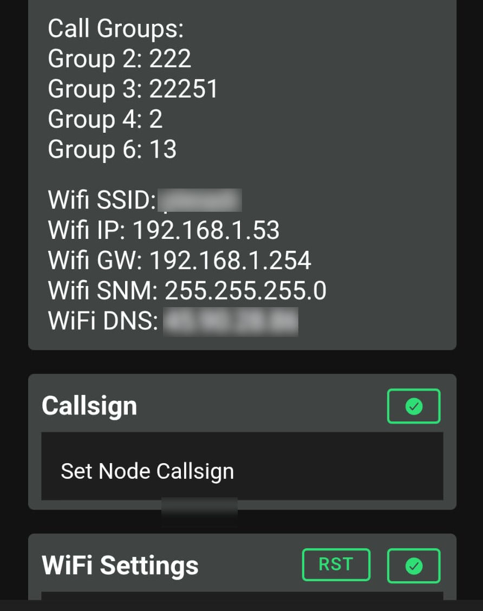
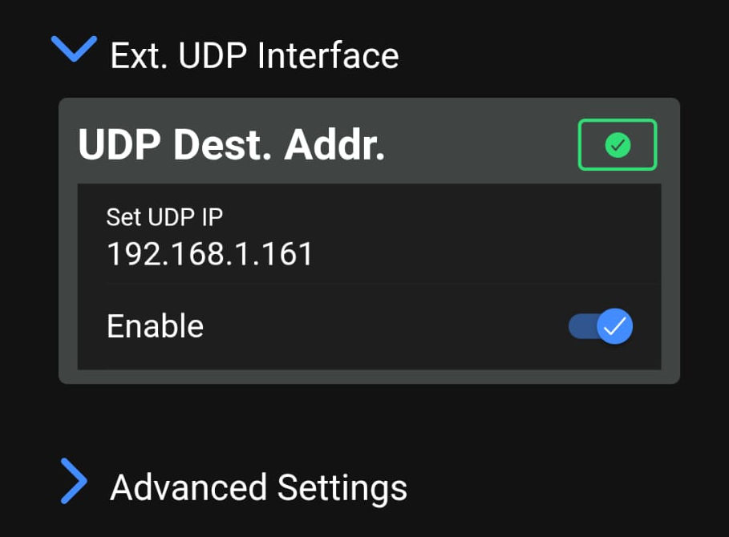

# First Setup

This guide covers the first network setup for a MeshCom node and `gomeshcomd`.

Use it when you want the node to forward ExtUDP traffic to the machine running goMeshCom.

## What You Need

- MeshCom node connected to Wi-Fi
- MeshCom node reachable from the goMeshCom host
- IP address of the MeshCom node
- IP address of the machine that will run `gomeshcomd`
- Inbound UDP access on port `1799` on the host firewall

This setup is usually done on a local network. A public-IP setup is possible too, but it needs extra care: routing, firewall rules, and external UDP exposure must all be configured correctly.

## 1. Find the MeshCom Node IP

Make sure the MeshCom node is connected to Wi-Fi first.

Open the MeshCom device configuration and read the Wi-Fi section.

The `WiFi IP` field is the node address on the LAN.



In the example above, the node IP is `192.168.1.53`.

## 2. Configure ExtUDP

Open `Ext. UDP Interface` on the MeshCom node.

Enable ExtUDP and set `UDP Dest. Addr.` to the IP address of the machine running goMeshCom.

Do not enter the node IP here. This field must point to the host that runs `gomeshcomd`.



In the example above:

- MeshCom node IP: `192.168.1.53`
- goMeshCom host IP: `192.168.1.161`

## 3. Open Firewall Port 1799/UDP

`gomeshcomd` listens for incoming MeshCom UDP traffic on port `1799` by default.

Make sure the host firewall allows inbound UDP packets on `1799`.

Examples:

- Linux UFW: `sudo ufw allow 1799/udp`
- firewalld: allow UDP port `1799`
- Windows Defender Firewall: create an inbound UDP rule for port `1799`

If the firewall blocks this port, the node may send packets correctly but goMeshCom will not receive them.

## 4. Restart the Node

Save the configuration and restart the MeshCom device.

Some firmware versions apply the new ExtUDP destination only after a reboot, so the restart is required even if the settings look correct.

## 5. Start `gomeshcomd`

Start goMeshCom with your callsign:

```bash
./gomeshcomd --my-call="IU5PMP-1"
```

If you want to pin the node address manually, add `--node-addr`:

```bash
./gomeshcomd --my-call="IU5PMP-1" --node-addr="192.168.1.53:1799"
```

That flag is optional. In normal setups, `gomeshcomd` learns the node address from the first valid incoming UDP packet.

## 6. Open the Web UI

Open the browser on:

```text
http://localhost:8080
```

If you want to reach the UI from other machines, bind `gomeshcomd` to `0.0.0.0:8080` or to the specific host IP you want to expose, then allow inbound TCP `8080` on the firewall.

If you keep the service local only, leave the default loopback bind and open `http://localhost:8080`.

## Quick Checklist

- Node IP known
- ExtUDP enabled
- `UDP Dest. Addr.` points to goMeshCom host IP
- Firewall allows inbound UDP `1799`
- Node restarted after saving
- `gomeshcomd` started with your callsign
