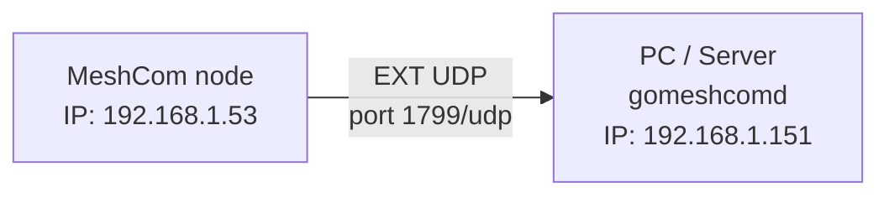

# Configuring MeshCom EXT UDP with `gomeshcomd`

This guide explains how to connect a **MeshCom** node to `gomeshcomd` using the **EXT UDP** interface provided by the MeshCom firmware.

The goal is to make the node send UDP packets to the computer or server where `gomeshcomd` is running, so that data, messages, and events can be received through the program interface.

> **Note:** this guide is about `gomeshcomd`. MeshCom, MeshCom Firmware, and other MeshCom-compatible software are separate projects. Field names in the firmware may vary slightly depending on the installed version.

---

## 1. Logical diagram

The configuration is based on a simple concept:

```text
MeshCom node  ── EXT UDP / port 1799 ──>  PC or server running gomeshcomd
```

Practical example:



The IP addresses are examples only. In your network they may be different, for example `10.0.0.x`, `172.16.x.x`, or another private subnet.

---

## 2. What you need to know before configuring

Before changing the MeshCom node configuration, collect the following information:

| Item | Where to find it | Example |
|---|---|---|
| MeshCom node IP address | Node Wi-Fi page or menu | `192.168.1.53` |
| PC/server IP address | PC/server operating system | `192.168.1.151` |
| UDP port used by `gomeshcomd` | Program configuration or command-line parameter | `1799` |
| Personal callsign | Your callsign with optional SSID | `IU5PMP-1` |

The most important point is this:

```text
In the node's UDP Dest. Addr. field, enter the IP address of the PC/server,
not the IP address of the MeshCom node.
```

---

## 3. Finding the PC/server IP address

On the node, you must enter the address of the machine running `gomeshcomd`.

### Linux

```bash
hostname -I
```

or:

```bash
ip addr
```

### Windows

```bat
ipconfig
```

Look for the **IPv4** address of the active network adapter.

### macOS

For the main Wi-Fi interface:

```bash
ipconfig getifaddr en0
```

Alternatively:

```bash
ifconfig
```

---

## 4. Configuring EXT UDP on the MeshCom node

Open the MeshCom node configuration and look for the section related to **EXT UDP** or **Ext. UDP Interface**.

Set the values as follows:

| Node field | Value to enter |
|---|---|
| `Enable EXTUDP` | `ON` / enabled |
| `UDP Dest. Addr.` | IP address of the PC/server running `gomeshcomd` |
| `UDP Target Port` | `1799` |

Example:

```text
Enable EXTUDP:    ON
UDP Dest. Addr.:  192.168.1.151
UDP Target Port:  1799
```

After saving, restart the MeshCom node. In some firmware versions, a reboot is required for the UDP configuration to be applied correctly.

---

## 5. Starting `gomeshcomd`

Open a terminal in the folder where the program is located.

Minimal startup:

```bash
./gomeshcomd --my-call="IU5PMP-1"
```

Startup with the MeshCom node address specified as well:

```bash
./gomeshcomd --my-call="IU5PMP-1" --node-addr="192.168.1.53:1799"
```

Where:

| Parameter | Meaning |
|---|---|
| `--my-call` | Your callsign with SSID |
| `--node-addr` | IP address and UDP port of the MeshCom node |

---

## 6. Opening the web interface

If you are using the browser on the same computer where `gomeshcomd` is running:

```text
http://localhost:8080
```

If `gomeshcomd` is running on another computer in the network:

```text
http://SERVER_IP:8080
```

Example:

```text
http://192.168.1.151:8080
```

---

## 7. Firewall: allowing UDP 1799

If the firewall blocks the UDP port, `gomeshcomd` may start correctly but receive no packets from the node.

### Windows, command prompt as administrator

```bat
netsh advfirewall firewall add rule name="gomeshcomd UDP 1799" protocol=UDP dir=in localport=1799 action=allow
```

### Linux with UFW

```bash
sudo ufw allow 1799/udp
```

### Linux with firewalld

```bash
sudo firewall-cmd --add-port=1799/udp --permanent
sudo firewall-cmd --reload
```

---

## 8. Quick checks

### Check that the UDP port is listening

Linux:

```bash
ss -lunp | grep 1799
```

or:

```bash
sudo lsof -iUDP:1799
```

Windows PowerShell:

```powershell
Get-NetUDPEndpoint | Where-Object { $_.LocalPort -eq 1799 }
```

### Check whether packets are arriving from the node

On Linux, you can use `tcpdump`:

```bash
sudo tcpdump -ni any udp port 1799
```

If the configuration is correct, you should see UDP traffic coming from the MeshCom node IP address.

---

## 9. Common problems

| Problem | Recommended checks |
|---|---|
| `gomeshcomd` does not receive data | Check `UDP Dest. Addr.`, UDP port, firewall, and local network |
| Port `1799` is already in use | Another process is using the same port |
| The web UI opens but remains empty | The program is running, but no packets are arriving from the node |
| Data arrives only intermittently | Weak Wi-Fi, changed IP address, firewall/antivirus, or node not restarted |
| The node appears to be configured but does not send data | Save the configuration again and restart the node |

To see which process is using the port on Linux:

```bash
sudo lsof -iUDP:1799
```

---

## 10. Complete example

### MeshCom node

```text
Wi-Fi IP:          192.168.1.53
Enable EXTUDP:     ON
UDP Dest. Addr.:   192.168.1.151
UDP Target Port:   1799
```

### PC/server running `gomeshcomd`

```text
PC/server IP:      192.168.1.151
UDP port:          1799
Callsign:          IU5PMP-1
Web UI:            http://localhost:8080
```

### Startup command

```bash
./gomeshcomd --my-call="IU5PMP-1" --node-addr="192.168.1.53:1799"
```